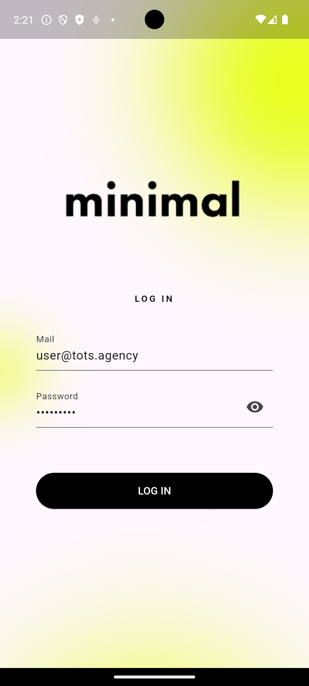
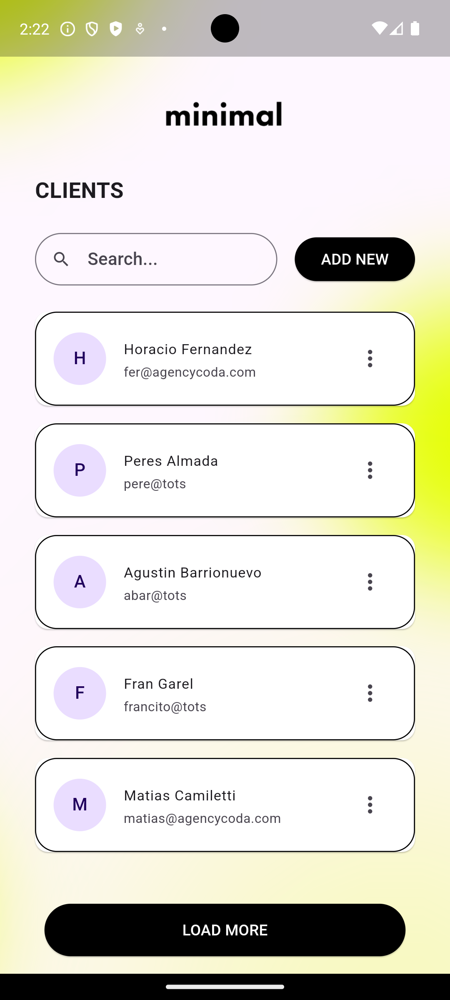
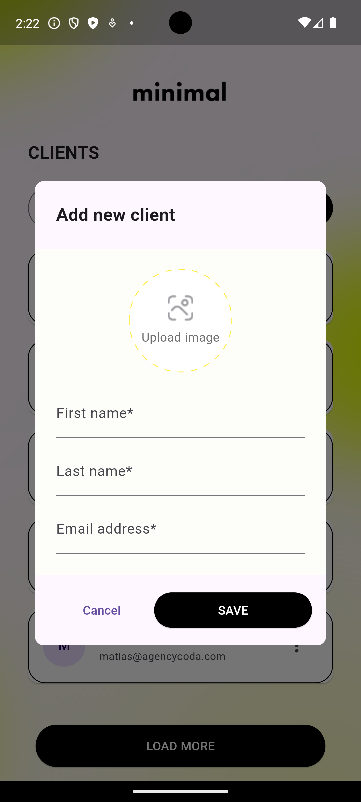
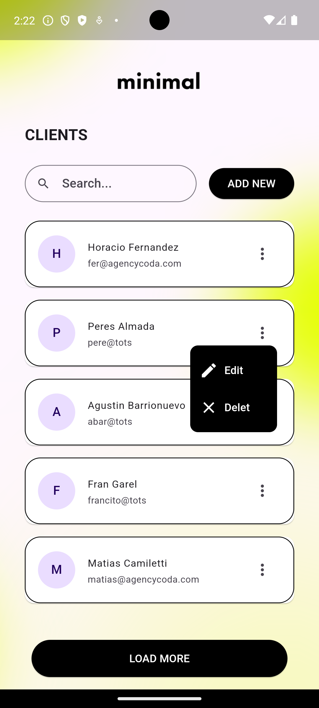
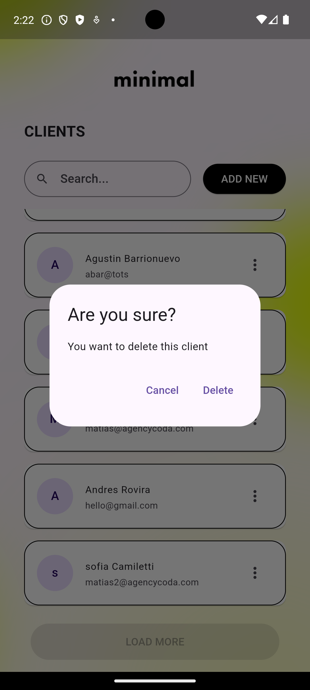
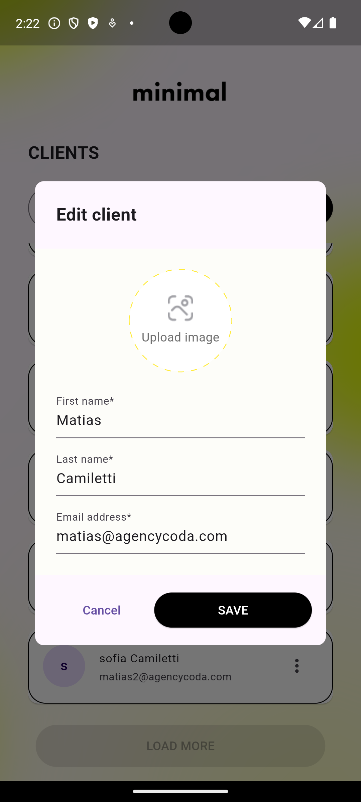
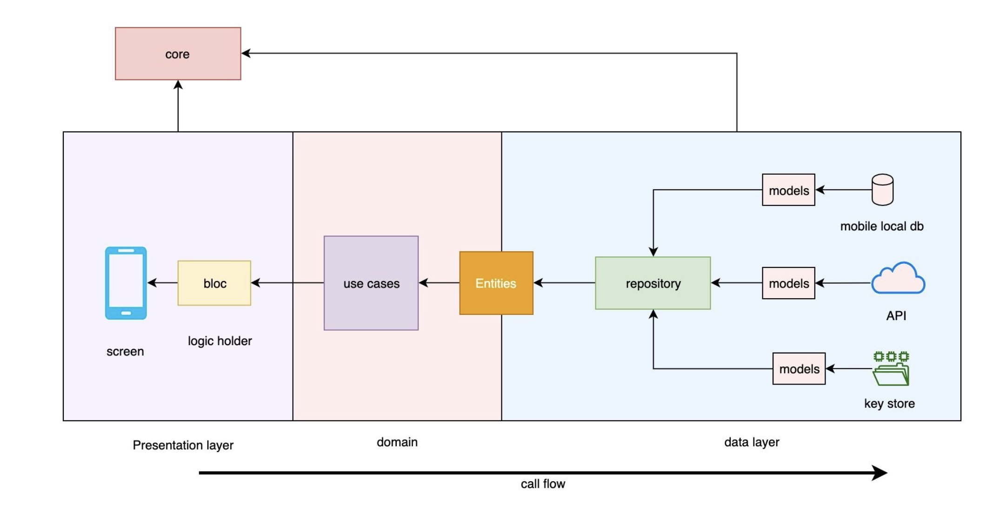

# minimal_app

A new Flutter project.

## Screenshots

<br>
<p align="center">






</p>

## Using on this app

- Clean Architecture
- Stacked
- either
- http
- [TOTS API](https://myback-execute-dot-my-back-401316.uc.r.appspot.com/6-tots-test)

## Clean Architecture Diagram




## How to use

To clone and run this application, you'll need [Git](https://git-scm.com/downloads) and [Flutter](https://flutter.dev/docs/get-started/install) installed on your computer. From your command line:

```
# Clone this repository
$ git clone https://github.com/andresroviram/tots-flutter.git

# Go into the repository
$ cd tots-flutter

# Install dependencies
$ flutter pub get

# generate codes
$ dart run build_runner build --delete-conflicting-outputs

# Run the app
$ flutter run
```
